<h1>
  Rufin
  <a href="Cargo.toml"></a>
  <a href="LICENSE"></a>
  <a href="https://gitlab.gnome.org/GNOME/libadwaita/"></a>
  <a href="https://flathub.org/apps/io.github.screwys.Rufin"></a>
  <a href="https://aur.archlinux.org/packages/rufin-bin"></a>
  <a href="https://hosted.weblate.org/projects/rufin/"></a>
</h1>

 Rufin is a powerful, fast and easy to use GTK4/libadwaita music player written in Rust, available on [multiple platforms](#installation). It can play music from your Jellyfin, Navidrome/OpenSubsonic flavor servers and local folders; can download tracks from these servers and let you play from downloaded songs while still keeping you in the same remote session. It also has broad set of features and optimizations around these features for the ideal user experience.

<br clear="left">

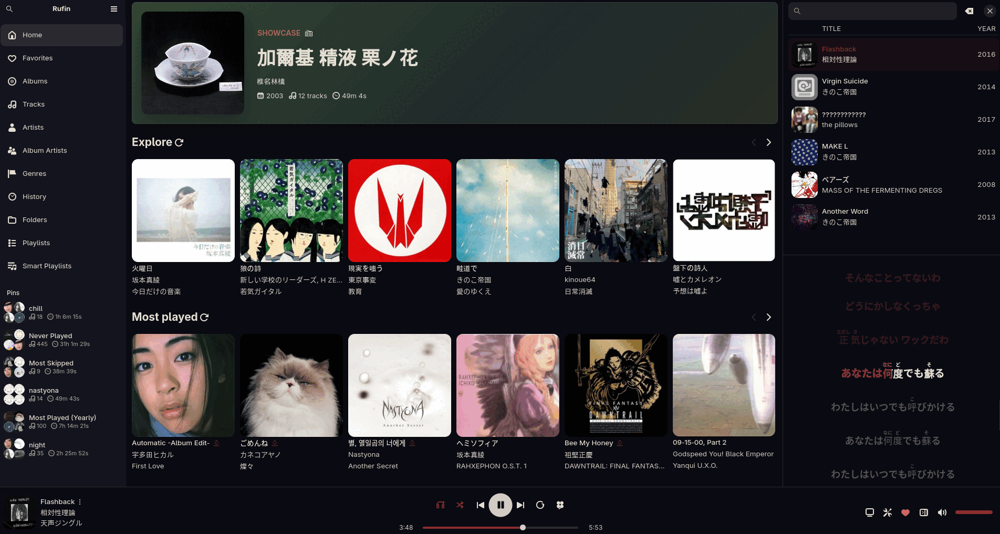

# Features

## 🎵 Playback

- True gapless playback and configurable equal-power crossfade mode 
- ReplayGain/EBU R128 analysis and true-peak measurement
- 10-band equalizer with presets, perceptual/linear volume scale preference and fade on play/pause
- Auto DJ that keeps the queue filled; server recommendations when available with a smart local fallback 
- Random play with filters for track count, year range, genre and played/unplayed status
- Optional waveform seekbar; waveforms are generated for the current track and cached
- Fullscreen player with visualizer
- CUE sheet support with separate playable tracks
- Broad codec support [^codecs]
- Audio output device selection
- Configurable playback speed


## 📚 Library

- First-class Jellyfin, Navidrome/OpenSubsonic and local music library support
- Drag songs from your queue or lists to playlists, or select multiple of them with your keyboard batch operations
- Combine multiple local folders in a single listening session
- Download tracks manually or through automatic rules, then keep using the same remote library while offline
- Path matching between music servers and local folders, allowing local playback while keeping server activity and history
- Metadata editing for supported servers and local formats; bulk editing and `Identify` available with auto-fill
- Automatic metadata, artwork and lyrics caching
- Extensive lyrics settings
- Easy rating support, with an option to enable visual-only partial stars for OpenSubsonic
- Virtualized, smooth to scroll pages
- EBU R128 tag writing option for local folders
- Extensive lyrics organization settings; you can automatically save fetched lyrics to your source as embeds or separate .lrc files

## 🌍️ Discovery

- Server-provided artist, track, album, playlist and genre radios, including recommendations from server plugins
- App owned smart playlists with custom sorting and limits; can use metadata, play/skip history or pre-defined dynamic lists
- Dedicated Search, Folders and History pages
- Moods browsing and mood/BPM-based smart playlists for Navidrome, Subsonic and local libraries
- Synchronized lyrics with built-in search and adjustable offset
- Furigana and Romaji lyrics overlays, translation preference and karaoke mode support

## 🔌 Integrations

- Last.fm, Libre.fm and ListenBrainz scrobbling, with offline storage and automatic retries 
- Discord Rich Presence
- Private mode for temporarily pausing external activity
- Secure storage for server credentials and API secrets by default
- Casting support for UPnP and Chromecast

## 🖥️ Interface

- Fast GTK 4/libadwaita interface with light/dark themes and accent customization
- Fully usable across different window sizes, including a separate compact layout 
- Adjustable sidebars with separate presets for different window sizes
- Configurable layouts, context menus and GTK menus
- Extensive keyboard shortcuts catalog
- Automatic updates for Windows and macOS builds
- Easy built-in log viewing and exporting (privacy-conscious)
- Type to search for routes
- Can run in the background or set to launch minimized
- System tray integration

# Screenshots

| | | | |
|:---:|:---:|:---:|:---:|
| 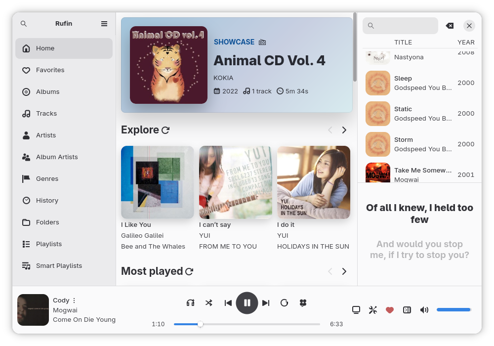 | 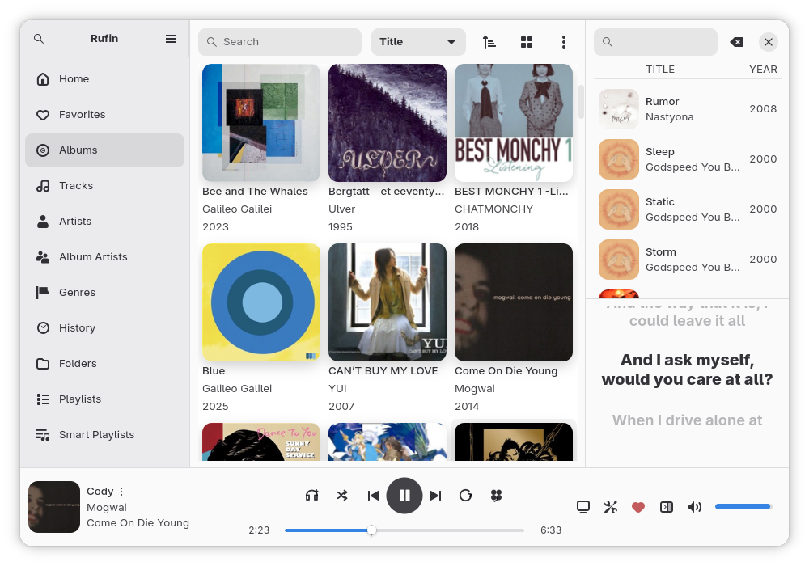 | 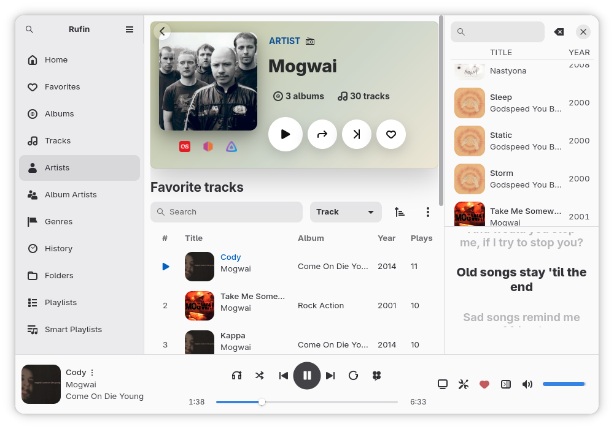 | 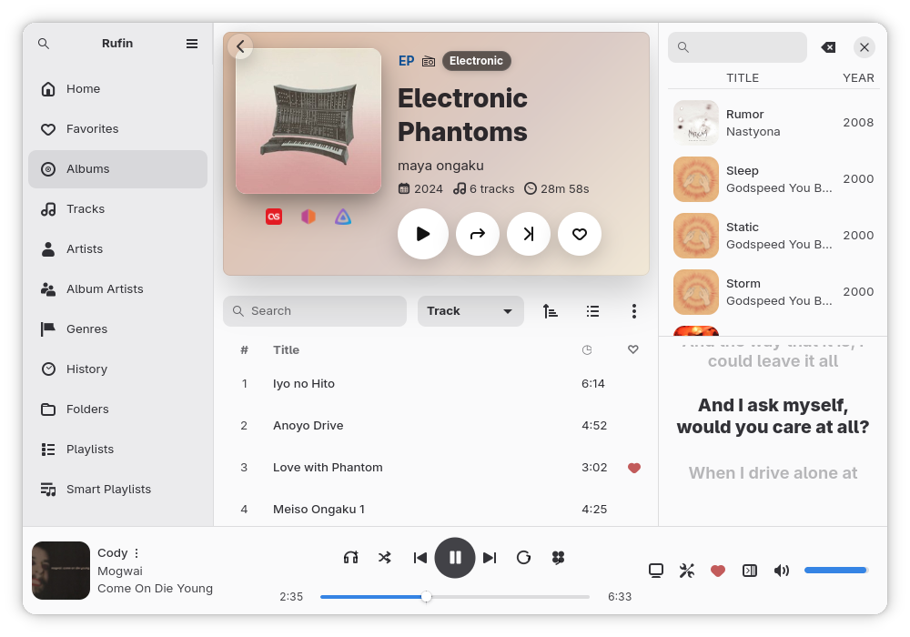 |
| **Home** | **Albums** | **Artist details** | **Album details** |
| 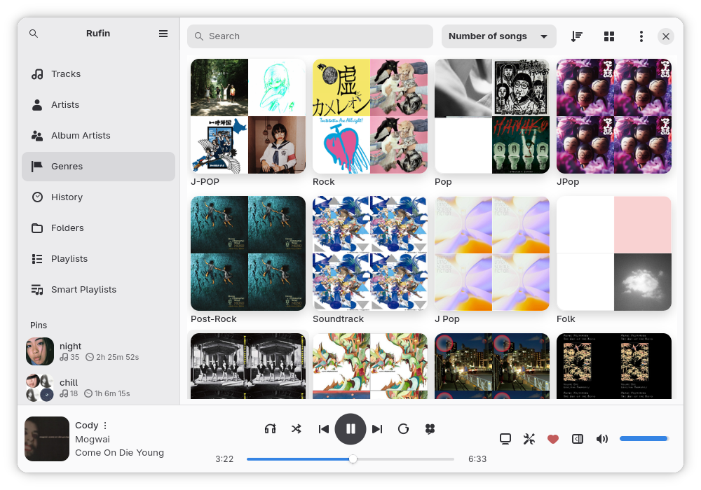 | 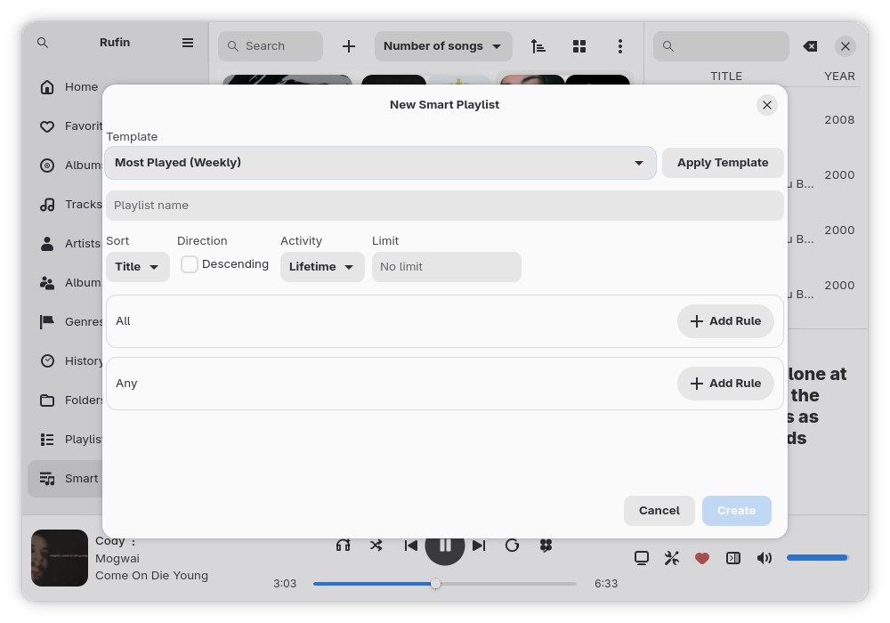 | 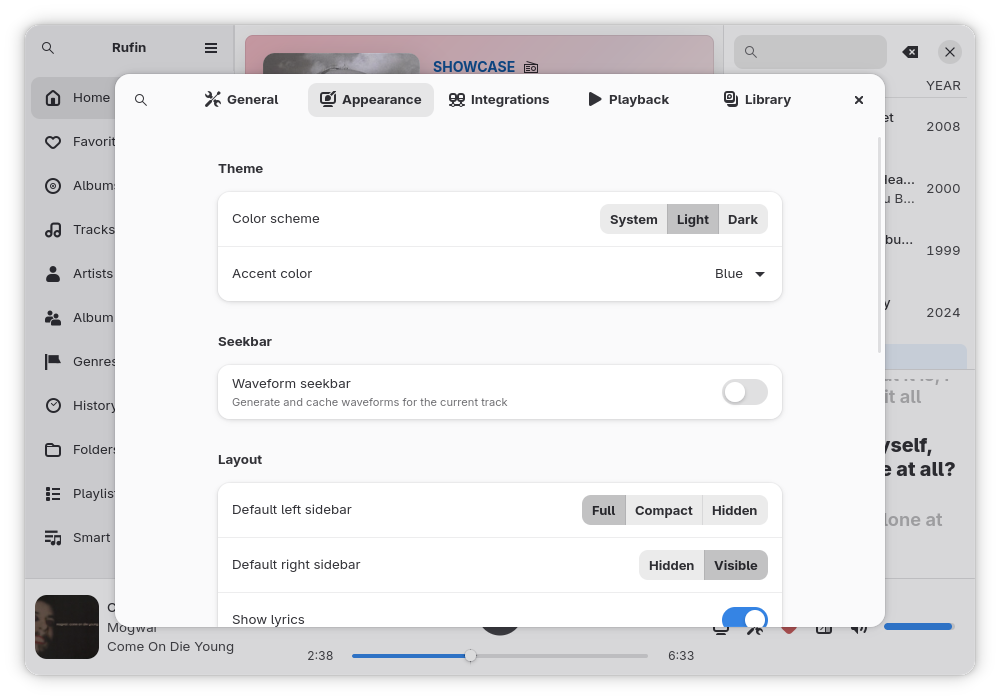 | 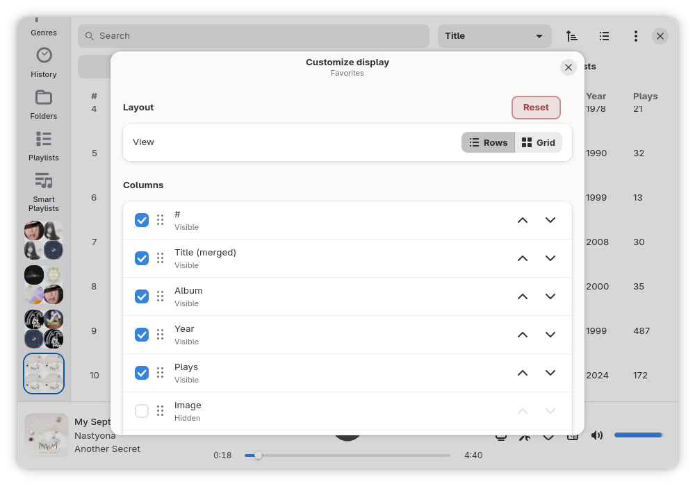 |
| **Genres** | **Smart playlists** | **Appearance settings** | **Customize display** |
| 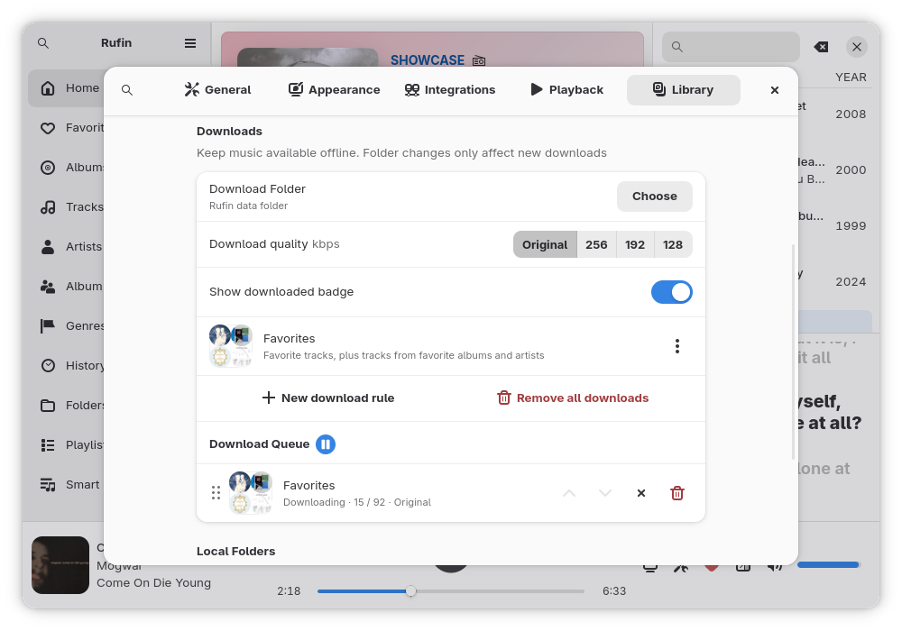 | 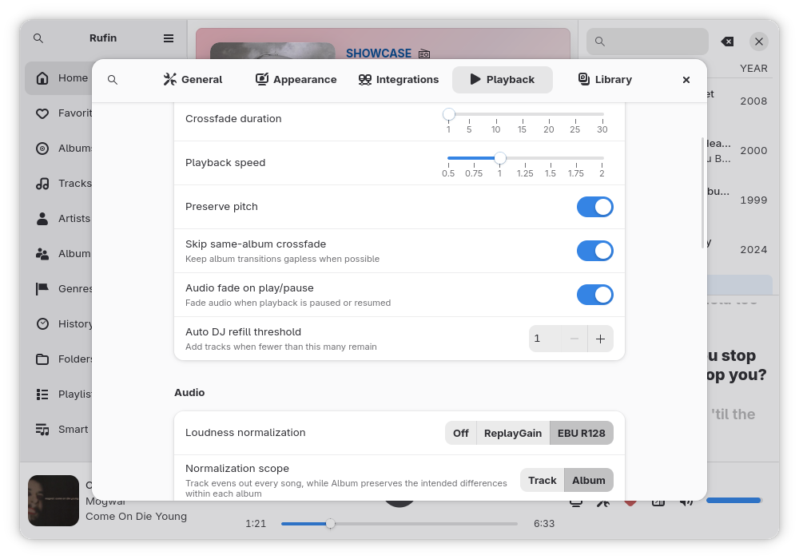 | 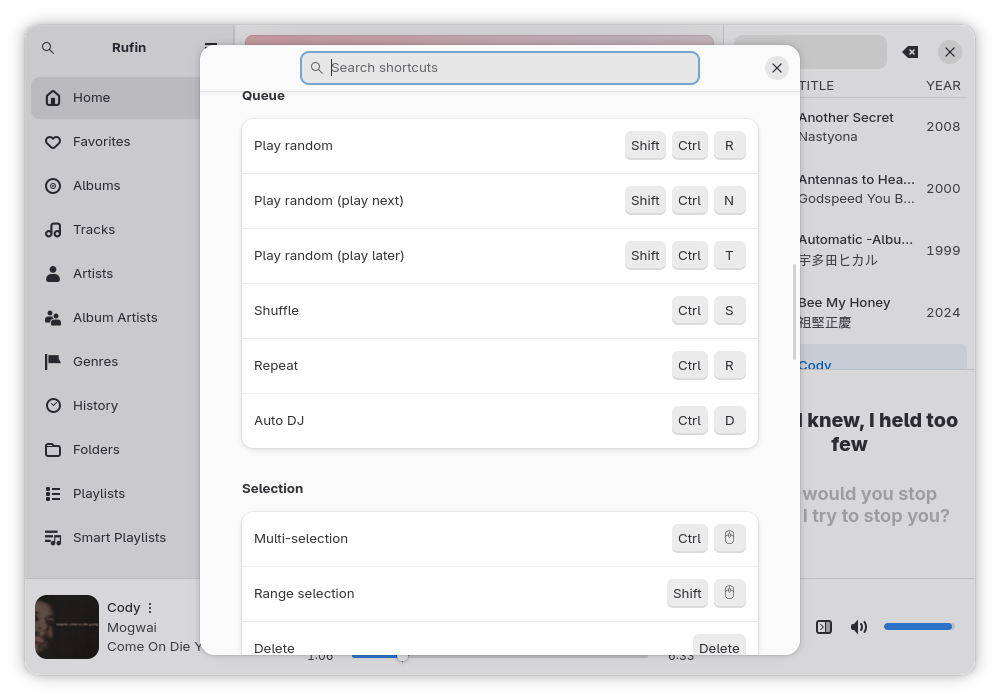 | 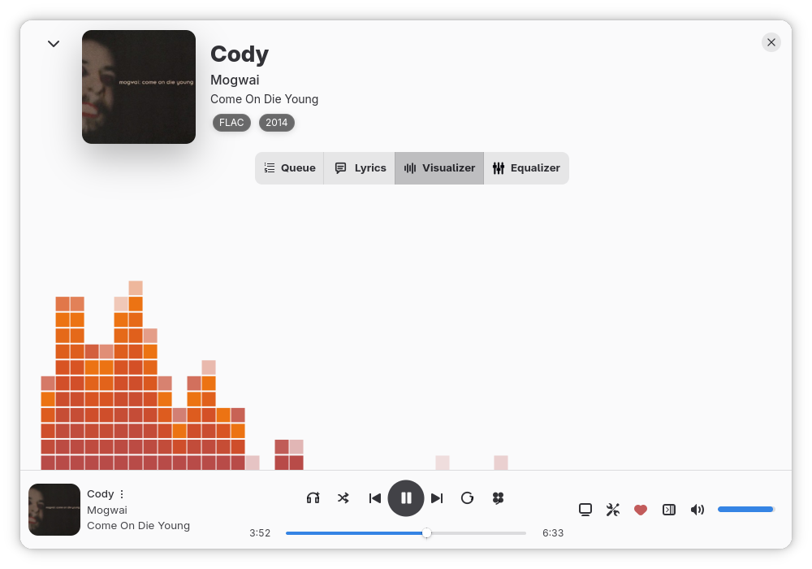 |
| **Download settings** | **Playback settings** | **Keyboard shortcuts** | **Fullscreen player** |

# Installation

## Flatpak
<p>
  <a href="https://flathub.org/apps/io.github.screwys.Rufin">
    
  </a>
</p>

## Fedora

Rufin is available for Fedora 44.

```bash
sudo dnf copr enable screwyy/rufin
sudo dnf install rufin
```

## AUR

- `rufin-bin` installs the release binary. `rufin-git` builds the current source.

```bash
yay -S rufin-bin
yay -S rufin-git
```

## Nix

Rufin is available in nixpkgs repository. To run Rufin without installing:

```bash
nix run nixpkgs#rufin
```

To add it to your profile:
```bash
nix profile install nixpkgs#rufin
```

You can also run `main` or an older release directly. 

```bash
nix run github:screwys/Rufin/main
nix run github:screwys/Rufin/vX.Y.Z
```
You might want to use github repo for profile as well, since it takes more than a week for an update to get merged into nixpkgs repository.


## Windows

Download the .exe from [GitHub Releases](https://github.com/screwys/Rufin/releases/latest).

Rufin is also available via Scoop:

```powershell
scoop bucket add screwys https://github.com/screwys/scoop-bucket
scoop install screwys/rufin
```

Both have opt-in **Automatic updates** in General preferences to have Rufin install an available Windows
update when the app starts. Alternatively, you can click `Update` button in Version History on the latest release.

## macOS

Homebrew Cask is the primary macOS installation:

```bash
brew tap screwys/tap
brew install --cask rufin
```

You can turn on **Automatic updates** in General preferences to have
Rufin install an available update when the app starts or manually click `Update` button in Version History on the latest release.

You can also download `.dmg` files directly from
[GitHub Releases](https://github.com/screwys/Rufin/releases/latest), but then you have to update manually.

## Building locally

Start by cloning the repository. You can build Rufin natively or use our Linux development container if you want to keep dependencies outside of your system and have Docker or Podman available.

```bash
git clone https://github.com/screwys/Rufin.git
cd Rufin
```

### Development container

```bash
just container setup
just build
```

This makes just commands go through the container development. If you want to build natively instead after running this one, use `just container disable`.

### Native build

Rufin requires Rust 1.95 or newer, GTK 4.20 or newer, libadwaita 1.9 or
newer, and GStreamer 1.26 or newer.

**Arch Linux:**

```bash
sudo pacman -S --needed \
  base-devel rust cargo just pkgconf gettext gtk4 libadwaita \
  gstreamer gst-plugins-base gst-plugins-good gst-plugins-bad \
  gst-plugins-ugly gst-libav
```

**Fedora:**

```bash
sudo dnf install \
  gcc rust cargo just pkgconf-pkg-config gettext gtk4-devel \
  libadwaita-devel gstreamer1-devel gstreamer1-plugins-base-devel \
  gstreamer1-plugins-base gstreamer1-plugins-good \
  gstreamer1-plugins-bad-free gstreamer1-plugins-bad-free-extras \
  gstreamer1-plugins-ugly-free gstreamer1-plugin-libav
```

For additional codecs, install the matching GStreamer plugins.

**Windows:** Windows builds run natively in the MSYS2 UCRT64 environment. From its Windows
UCRT64 terminal, use MSYS2's `pacman.exe` to install the build and packaging
dependencies:

```bash
ucrt=mingw-w64-ucrt-x86_64
pacman -S --needed base-devel git \
  "$ucrt"-{adwaita-icon-theme,cmake,gdk-pixbuf2,gettext-runtime,gettext-tools} \
  "$ucrt"-{gst-libav,gst-plugins-bad,gst-plugins-base,gst-plugins-good} \
  "$ucrt"-{gst-plugins-ugly,gstreamer,gtk4,hicolor-icon-theme,libadwaita} \
  "$ucrt"-{just,ninja,nsis,perl,pkgconf,rust,shared-mime-info,toolchain,wavpack}
```

**macOS:**

```bash
brew install \
  rust just pkgconf gettext gtk4 libadwaita gstreamer \
  dylibbundler librsvg game-music-emu libopenmpt libsoup meson ninja openssl@3 wavpack
```

**Building:** After you installed dependencies for your operating system, you can build and run:

```bash
just build
just debug
```

Local builds are shown as `Rufin (Development)` and use the isolated `Rufin.Devel` application
identity. The first macOS `just debug` or
`just build dmg` automatically creates the persistent local `Rufin Development` signing identity. The first signing operation may ask for access to the certificate's private
key; **Always Allow** should keep this one-time.

On macOS, `just build dmg` creates `.local/artifacts/Rufin.Devel.dmg` for installation and
platform behavior testing.
On Windows, `just build windows` creates the isolated versioned
`.local/artifacts/Rufin.Devel-*-setup.exe` installer.

Testing, Nix, and container controls are documented in
[CONTRIBUTING.md](CONTRIBUTING.md#development-environment).

# Troubleshooting

> [!WARNING]
> If you are using native Discord with Flatpak Rufin, you should add the `xdg-run/discord-ipc-0` filesystem override via Flatseal, or from the terminal:
>
> ```bash
> flatpak override --user --filesystem=xdg-run/discord-ipc-0 io.github.screwys.Rufin
> ```
>
> This override is only for this combination, else it works out of the box.

Open **Troubleshooting** from the main menu, enable **Debug logging**, reproduce the problem, then click `Save`. Crash logs also appear here on
the next launch. Logs have secrets and absolute folder paths redacted, but you may still want to review the logs before sharing them.

Or you can just run Rufin from the terminal:

```bash
flatpak run --env=RUST_LOG=debug io.github.screwys.Rufin 2>&1 # for flatpak
```

```bash
RUST_LOG=debug rufin # for native packages
```

```bash
just debug  # for local build
```

To test if Rufin can play a specific media (reading metadata and actual GStreamer audio decoding):

```bash
flatpak run --filesystem=host:ro io.github.screwys.Rufin --verify-media (realpath "media_path.format")
  ```
```bash
rufin --verify-media "media_path.format"
  ```

```bash
cargo run -p rufin -- --verify-media "media_path.format"
```
If should exit silently if the media can be played.

## Uninstallation

You can remove Rufin with your package manager, use the uninstaller included with the Windows
`.exe` (which can also delete the cache), or delete `Rufin.app` from Applications if you installed the macOS `.dmg`.

To delete Rufin's cache as well, delete its cache folder based on your operating system:

- Linux and FreeBSD: `~/.cache/rufin`
- Flatpak: `~/.var/app/io.github.screwys.Rufin/cache/rufin`
- macOS: `~/Library/Caches/io.github.screwys.Rufin`
- Windows: `%LOCALAPPDATA%\screwys\Rufin\cache`

# Contributing

To contribute code, please see [CONTRIBUTING.md](CONTRIBUTING.md). 

## Translations

You can also contribute by translating the app on [Weblate](https://hosted.weblate.org/projects/rufin/app/)

[](https://hosted.weblate.org/engage/rufin/?utm_source=widget)

# Credits

Built with [GTK 4](https://www.gtk.org/), [libadwaita](https://gitlab.gnome.org/GNOME/libadwaita/), [gtk-rs](https://gtk-rs.org/) and [GStreamer](https://gstreamer.freedesktop.org/)

Rufin is greatly influenced by [Feishin](https://github.com/jeffvli/feishin), and a lot of design decisions are directly borrowed; as much we can achieve natively.

Player backend design and Smart Playlists are inspired from [Strawberry](https://github.com/strawberrymusicplayer/strawberry) (fork of [Clementine](https://github.com/clementine-player/Clementine)).

Icon is designed by [Commenter25](https://commenter.cc) and it is licensed under CC-BY-SA-3.0.

## Translation credits

- Estonian translation by Priit Jõerüüt
- Russian and Latvian translation by [aguhadug](https://github.com/aguhadug)
- German translation by [sevachka](https://github.com/sevachka)
- Chezch translation by [Jakub Cabal](https://github.com/jakubcabal)

# License

[LICENSE](LICENSE)

[^codecs]:AAC and ALAC (including M4A/MP4), AIFF and WAV, APE, FLAC, TTA and WavPack, MP1/MP2/MP3 and Musepack, Ogg Vorbis/Opus/Speex, MKA and audio-only WebM, WMA/ASF, DSD, tracker modules such as MOD/XM/IT/S3M/MPTM, and emulated game music such as NSF/VGM. All supported packages have the required plugins. You may need additional GStreamer plugins if you are building Rufin natively; after installing them, restart Rufin and Resync the local library to retry rejected files.
